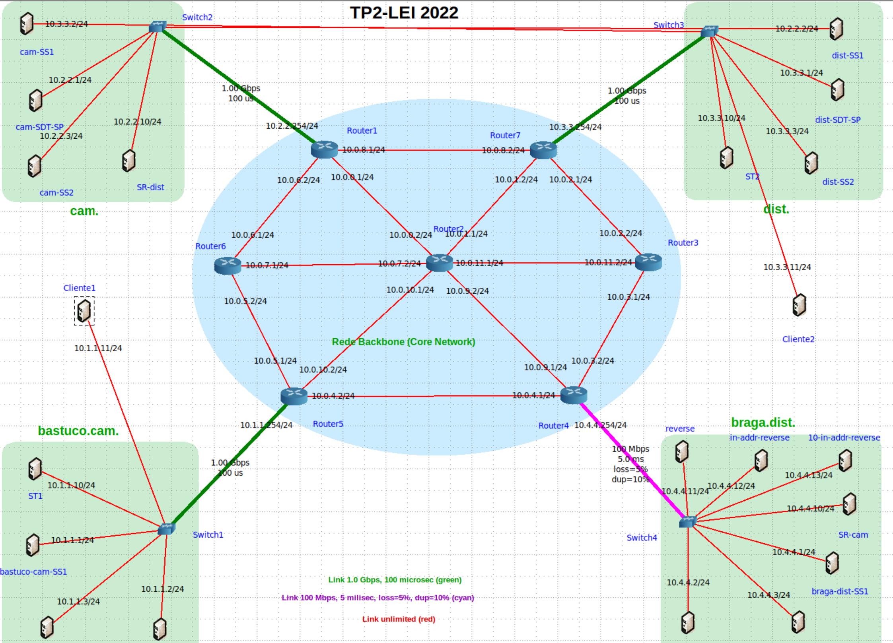
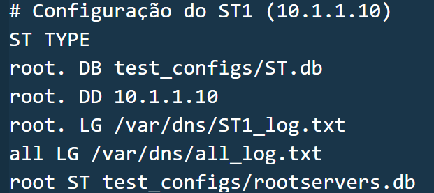
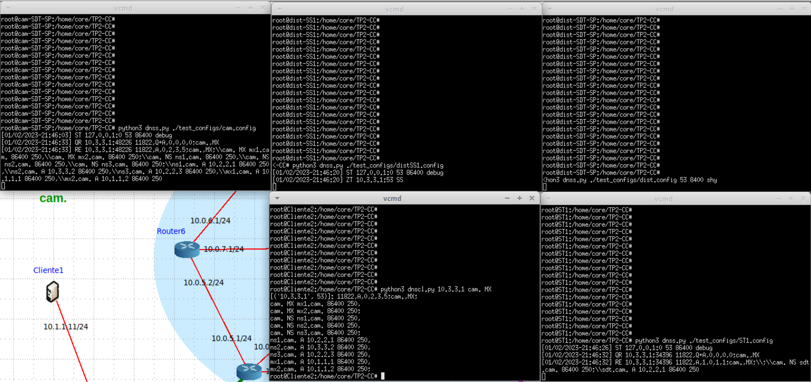
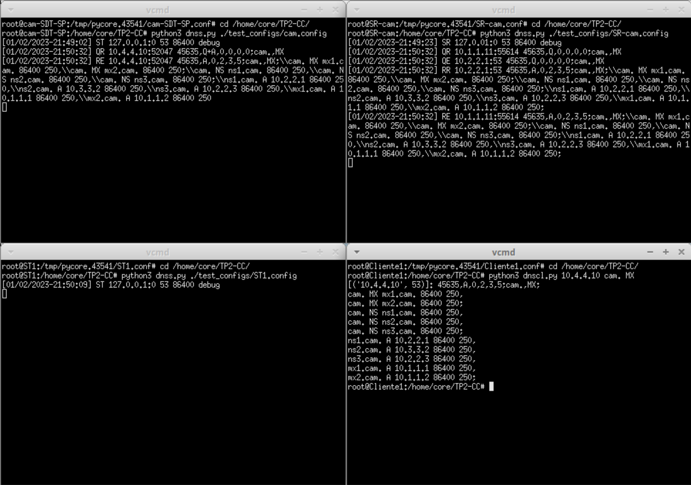
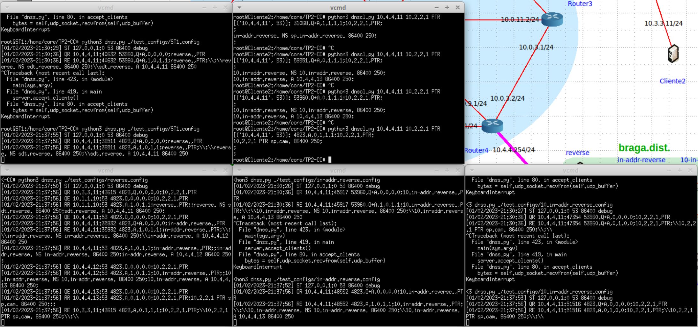
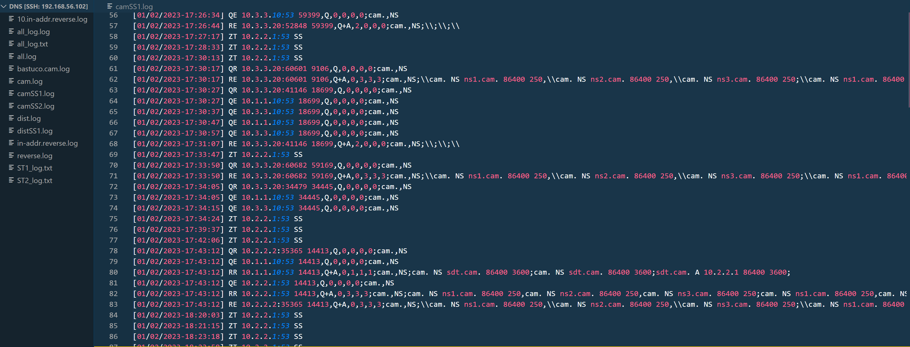

# <!--fit-->Implementação de Sistemas de DNS :computer:

<span style="color:grey">**Comunicação por Computadores**</span>


G2.03

Ricardo Oliveira (A96794)
Rodrigo Freitas (A96547)

---

### Introdução

Este projeto tem como objetivo desenvolver um sistema de DNS. Esse deverá ser capaz de receber e responder a querys DNS em redes compostas por diversos servidores e clientes espalhados pela web.

---

<div style="text-align: left">

### Indice

- Arquitetura do Sistema
- Modelo de Informação
- Modelo de Comunicação
- Planeamento do Ambiente de Testes
- Implementação de Cliente
- Implementação da Cache
- Implementação de Servidores
- Funcionamento do Programa
- Conclusão

<div>

---

<div style="text-align: left">

### Arquitetura do Sistema

#### Cliente

- O cliente tem como função a realização de queries DNS;
- Não necessita de ficheiro de configuração adicionais;
- Utiliza conexões através de Sockets UDP


<div>

---

<div style="text-align: left">

#### Servidores

Estão divididos em vários tipos:
- Servidor de Topo
- Servidor de Domínio de Topo
- Servidor Primário
- Servidor Secundário
- Servidor Recursivo

<div>

---

##### Caracteristicas

||ST|SDT|SP|SS|SR|
|-|-|-|-|-|-|
|Respode Querys|:white_check_mark:|:white_check_mark:|:white_check_mark:|:white_check_mark:|:white_check_mark:|
|Ficheiro de Configuração|:white_check_mark:|:white_check_mark:|:white_check_mark:|:white_check_mark:|:white_check_mark:|
|Lista de Servidores de Topo|:white_check_mark:|:white_check_mark:|:white_check_mark:|:white_check_mark:|:white_check_mark:|
|Comunicações UDP|:white_check_mark:|:white_check_mark:|:white_check_mark:|:white_check_mark:|:white_check_mark:|
|Comunicações TCP|:white_check_mark:|:white_check_mark:|:white_check_mark:|:white_check_mark:|:x:|
|Autoritários de um Domínio|:white_check_mark:|:white_check_mark:|:white_check_mark:|:white_check_mark:|:x:|
|Ficheiro de Base de Dados|:white_check_mark:|:white_check_mark:|:white_check_mark:|:x:|:x:|


---

#### Planeamento do Ambiente de Testes
Topologia de Testes

<div style="text-align: left; font-size: 24px">



- O ambiente de testes foi alterado face à primeira fase do projeto;
- Na fase final do projeto, a topologia é constituida por dois domínios de topo, dois subdominios, dois ST's, dois SR's e um domínio reverse;
- Foi utilizado o CORE para a criação e execução da topologia de testes.

<div>

---
##### Ficheiros de Configuração e Base de Dados


<div style="text-align: left; font-size: 24px">



Dado à alteração da topologia, foram também criados alguns ficheiros de configuração e base de dados novos.

<div>

---

<div style="text-align: left">

##### Hierarquia de Domínios

```
.
└───reverse.
|   └───in-addr.reverse.
|       └───10.in-addr.reverse.
└───cam.
|   └───batuco.cam.
└───dist.
    └───braga.dist.
```

<div>

---


<div style="text-align: left; font-size: 30px">

### Implementação de Cliente

Construtor:
```python
class Cliente:
    def __init__(self, adress, port):
        self.port = port
        self.address = adress
        self.cl_socket = socket.socket(socket.AF_INET, socket.SOCK_DGRAM)
        self.udp_buffer = 1024
```
Construção de Queries DNS a partir da CommandLine:
```python
    id = random.randint(0, 65535)
    query=str(id)+',Q'
    #Flags Adicionais
    if len(args)==5:
        query+='+'+args[4]
    query+=',0,0,0,0;'+args[2]+','+args[3]+';'
```

<div>

---


<div style="text-align: left; font-size: 30px">

##### Implementação de Cliente (Continuação)

Envio de Queries DNS:

```python
def send_msg(self,msg=''):
        #Envio de query através da Socket UDP
        self.cl_socket.sendto(msg.encode(), (self.address, self.port))
```

Receção de Respostas a Queries DNS:

```python
def receive_msg(self):
        #Espera pela resposta no mesmo Socket UDP
        bytes = self.cl_socket.recvfrom(self.udp_buffer)
        message = bytes[0].decode() #Endereço do servidor
        address = bytes[1] #Resposta DNS
        print('['+str(address)+']: '+message)
```

<div>

---

<div style="text-align: left; font-size: 30px">

##### Implementação de Cache

Construtor:
```python
class Cache:
    def __init__(self, default_ttl):
        self.default_ttl = default_ttl
        self.entrys = []
        for i in range(100):
            self.entrys.append(Entry(i,'','','',0,0,0.0))

class Entry:
    def __init__(self,index,name,type,value,ttl,priority,origin,state=False):
        self.index = index
        self.name = name
        self.type = type
        self.value = value
        self.ttl = ttl
        self.priority = priority
        self.origin = origin
        self.timeStamp = time.time()
        self.state = state
```

<div>

---

<div style="text-align: left; font-size: 25px">

##### Implementação de Cache (Continuação)

Insereção de um arquivo de base de dados na Cache:
```python
 def insert_DB(self,file):
        f = open(file, 'r')
        lines = f.readlines()
        for line in lines:
            list = line.split(' ')
            if line.startswith('#') or line == '\n':
                continue
            if self.search_available() != -1:
                ind = self.search_available()
                self.entrys[ind] = Entry(ind,list[0],list[1],list[2],list[3],list[4][:-1],'FILE',True)
            else:
                self.remove_entry_last()
                self.entrys[self.search_available()] = Entry(ind,list[0],list[1],list[2],list[3],list[4][:-1],'FILE',True)
```

Insereção de uma query na Cache:
```python
def insert_cache(self,string):
        list = string.split(' ')
        if self.search_available() != -1:
            ind = self.search_available()
            self.entrys[ind] = Entry(ind,list[0],list[1],list[2],list[3],list[4],'OTHERS',True)
        else:
            self.remove_entry_last()
            ind = self.search_available()
            self.entrys[ind] = Entry(ind,list[0],list[1],list[2],list[3],list[4],'OTHERS',True)
```

<div>

---

<div style="text-align: left; font-size: 30px">

### Implementação de Servidores

Construtor:
```python
class Server:
    def __init__(self, stype, address, port, domain, log_file, top_servers, default_ttl,
                debug, database=None,primary_server=None,default_servers=None):
        self.address = address
        self.port = port
        self.domain = domain
        self.clients = []
        self.tcp_socket = socket.socket(socket.AF_INET, socket.SOCK_STREAM)
        self.udp_socket = socket.socket(socket.AF_INET, socket.SOCK_DGRAM)
        self.udp_socket.bind((address,port))
        self.udp_buffer = 1024
        self.log_file = log_file
        self.top_servers = top_servers
        self.default_ttl = default_ttl
        self.debug=True
        self.stype=stype
        self.cache = cache.Cache(default_ttl)
```

<div>

---

<div style="text-align: left; font-size: 30px">

##### Implementação de Servidores (Continuação)

Implementação dos vários tipos de servidores:
<!--fit-->
```python
if stype=='SP' or stype=='ST' or stype=='SDT': 
    self.database = database
    self.cache.insert_DB(database[0])
    self.tcp_socket.bind((address,port))
    self.tcp_socket.listen(
elif stype=='SS':
    self.last_update = -1
    self.primary_server = primary_server
    self.default_servers = primary_serve
elif stype=='SR':
    self.default_servers = default_server
if debug=='shy':
    self.debug=Fals
for domain,log in self.log_file:
    f=open(log,'a+')
    f.close()
```

<div>

---

<div style="text-align: left; font-size: 30px">

##### Implementação de Servidores (Continuação)

Modo Iterativo:
1. O servidor recebe uma querie;
1. Verifica se os dados do servidor são válidos (SOAExpire ainda se encontra válido);
1. Procura resposta na cache;
1. Verifica se encontrou respostas:
    1. Cria resposta e envia de volta.
1. Não encontra resposta e é um SR:
    1. Procura resposta nos seus servidores *defaults*; 
    1. Caso encontre envia resposta de volta.

<div>

---

<div style="text-align: left; font-size: 30px">

##### Implementação de Servidores (Continuação)

Modo Iterativo (cont.):
1. Ainda não tem resposta mas não é o servidor original:
    1. Envia as informações que possui até ao momento.
1. Procura no domínio de topo uma resposta;
1. Se a resposta do dominio de topo não possuí *response values* pergunta a um dos servidores indicados pelo mesmo;
1. Processo repete-se até obter resposta ou erro que indique que não é possivel obter a mesma.

<div>

---

<div style="text-align: left; font-size: 30px">

##### Implementação de Servidores (Continuação)

Refresh da Cache:
```python
def cache_update(self, adress,port):
    primary_server=(adress,port)
    #Inicia a true pois a função é chamada após a primeira trânsferência de zona
    updated=True 
    self.last_update=time.time()
    while True:
        #Aguarda SOARefresh
        time.sleep(self.cache.get_refresh())
        #Deixa de estar updated
        updated=False
        while not updated:
            #Tenta receber cache
            i=self.receive_cache(primary_server)
            if i>=0:
                self.last_update=time.time()
                updated=True
                self.last_update=time.time()
            else:
                #Caso falhe volta a tentar após o tempo definido por SOARetry
                time.sleep(self.cache.get_retry())
```

<div>

---

<div style="text-align: left; font-size: 30px">

##### Implementação de Servidores (Continuação)

Escrita de Logs:
```python
def write_log(self, file, type, endereco, msg):
    #Tempo de quando o log foi escrito
    named_tuple = time.localtime()
    time_string = time.strftime("[%m/%d/%Y-%H:%M:%S]", named_tuple)
    #Criação da Mensagem
    message=time_string +' ' + type + ' ' + endereco[0]+ ':' + str(endereco[1]) + ' ' + msg
    #Se estiver no modo debug é mostrada no terminal 
    if self.debug:
        print(message)
    for domain,log in self.log_file:
        #Escreve log no ficheiro relativo ao dominio do mesmo
        if domain == file:
            with open(log, 'a+') as f:
                f.write(message+'\n')
```

<div>

---
### Funcionamento do Programa

---

#### Execução de uma query 



---

#### Funcionamento de um Servidor Resolver



---

### Funcionamento do Reverse



---

### Vizualização dos logs



---

### Conclusão

Pensamos ter conseguido uma implementação satisfatória dos objetivos propostos para este projeto dadas as condições de realização do mesmo e a sua complexidade.
Estamos satisfeitos com o produto final, cientes que o mesmo poderia ser melhorado com mais tempo.
